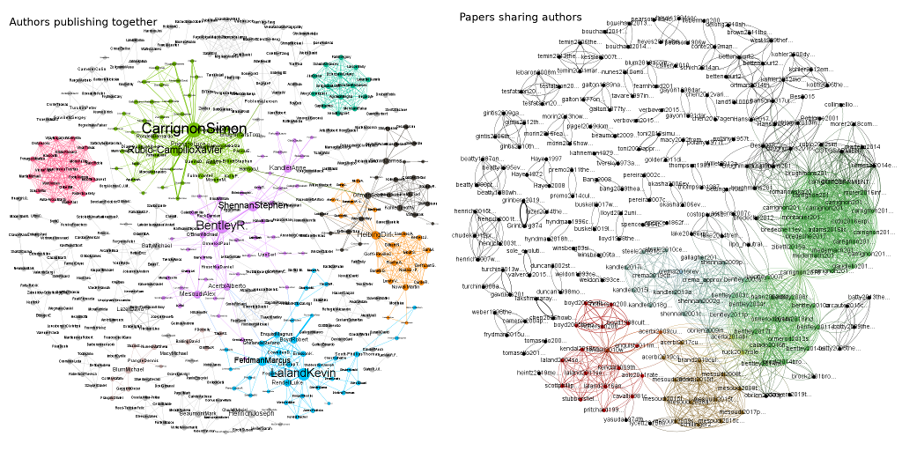

# Co-authorship analysis tool

This software is made to help analyse the connections between
publications. Which papers share authors, which authors publish
together?  What are the timelines? etc.

Robustness goes over precision. The analysis should work with any
given bibtex-file that has minimal information.  The cleaner the
bibtex-file (duplicates, name spellings, ...) the better the output,
i.e. more precise. This software is not intended for scientific
analysis of text corpora but for understanding connections in selected
publication lists.

It's a fork from  Simon Carrignon's original lines of code that can be
found [here](https://framagit.org/sc/pybibnet). Simon is also [on Github](https://github.com/simoncarrignon).

## Prerequisites

The software is developed, used and tested with `python3`.  It
requires
[`bibtexparser`](https://github.com/sciunto-org/python-bibtexparser)
which can be installed with `pip3 install bibtexparser`. Other
non-standard libraries are `networkx`, `matplotlib` and `numpy`. For
best results use a markdown renderer like `pandoc` to get
`.pdf`-Files.


## Usage

```bash
./main.py BIBTEXFILENAME
```

It expects a bibtex-file at `FILENAME`. A report is written to
`FILENAME.report.md` which can be viewed with a simple text
editor. But it looks much nicer when rendered as `pdf` or `html`. The
example `pdf` is made with `pandoc phd.bib.report.md -o
phd.bib.report.pdf`.

So far the network has to be visualized with a third party
program. Use the following files:

  * `FILENAME.authorlist.csv`
  * `FILENAME.authorNetwork.csv` - network of authors who share a publication
  * `FILENAME.paperlist.csv`
  * `FILENAME.paperNetwork.csv` - network of publications which share an author

To run the example do:

```bash
cd example
../main.py phd.bib
pandoc phd.bib.report.md -o phd.bib.report.pdf
```


[Gephi](https://gephi.org/) does a pretty good job doing at drawing
networks. The two following graphs were done with
[Gephi](https://gephi.org/) using the `bibtex`-file from the example.




## Warranty

There is none. The software might or might not work for you or even
have unexpected effects like data loss or much worse. I don't know,
but did use it and I would say it's rather safe to run. In any case:
always have a backup of your stuff!

## Authors

  * Niko Komin ([on Laikaundfreunde](http://www.laikaundfreunde.de/niko-komin))
  * Simon Carrignon ([on Framagit](https://framagit.org/sc), [on Github](https://github.com/simoncarrignon), [on Twitter](https://twitter.com/SimonCarrignon/)).


## License

See file `LICENSE`.
