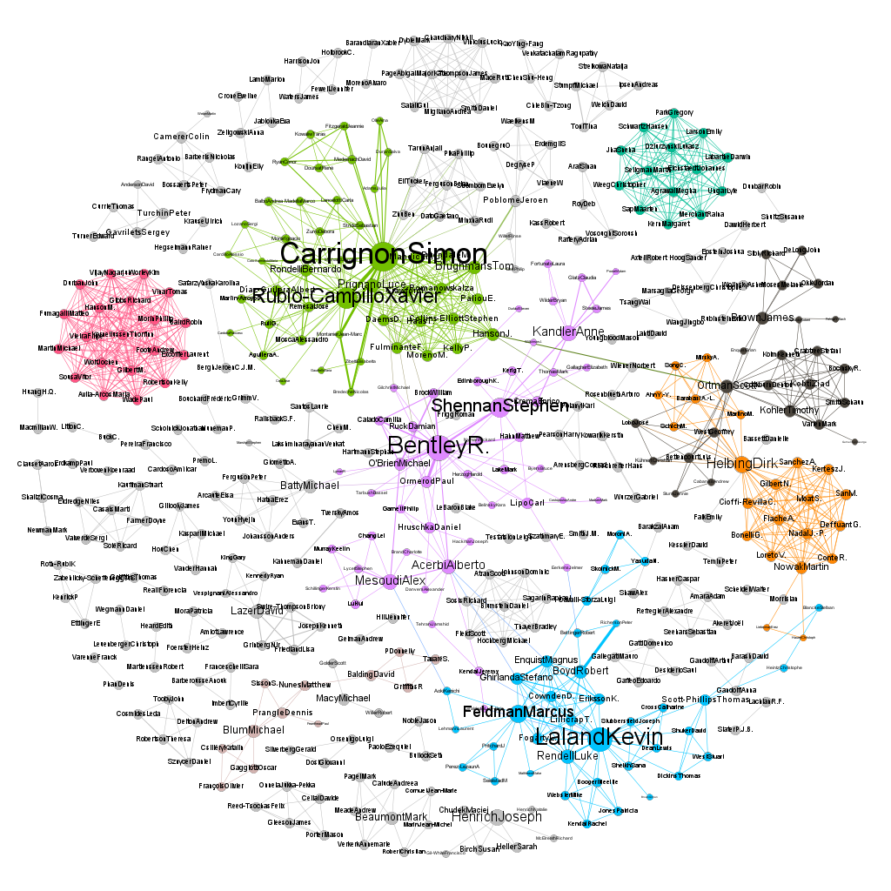

# Co-authorship analysis tool

This software is made to help analyse the literature of research
projects. Which papers share authors, which authors publish together?
Wjat are the timelines? etc.


Robustness goes over precision. The analysis should work with any
given bibtex-file that has minimal information.  The cleaner
the bibtex-file (duplicates, name spellings, ...) the better the
output, i.e. more precise. It is not intended for scientific
analysis of text corpora.

It's a fork from  Simon Carrignon's original lines of code that can be
found [here](https://framagit.org/sc/pybibnet).

## Prerequisites

The software is developed and used with `python3`. It makes use of the
package
[`bibtexparser`](https://github.com/sciunto-org/python-bibtexparser),
which can be installed typing:

    pip install bibtexparser

## Usage

```bash
./main.py BIBTEXFILENAME
```

It will read the bibtex-file and write the results in a bunch of new
files.

An example from my own PhD thesis is available in `example/`



## Warranty

There is none. The software might or might not work for you or even
have unexpected effects like data loss or much worse. I don't know,
but did used it and would say it's rather safe to run. Always have a
backup!

