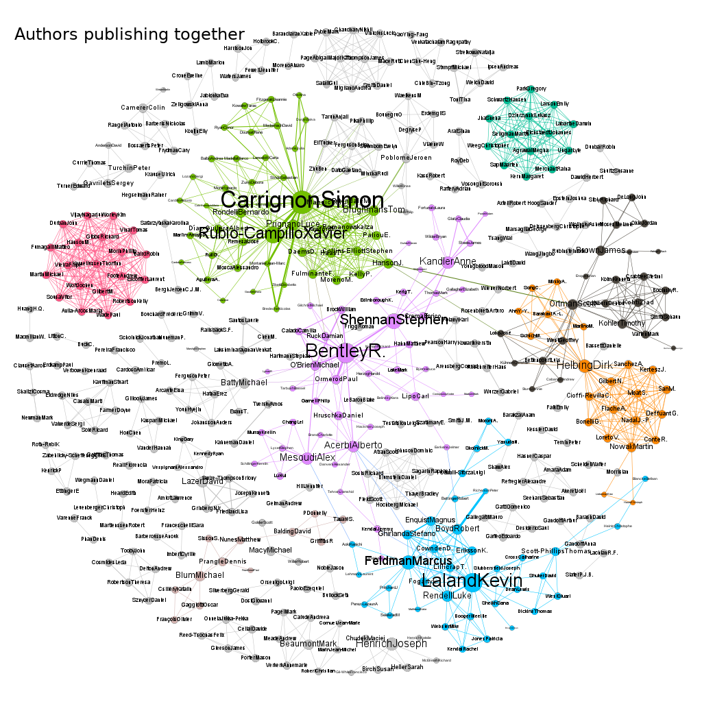

# Co-authorship analysis tool

This software is made to help analyse the connections between
publications. Which papers share authors, which authors publish
together?  What are the timelines? etc.

Robustness goes over precision. The analysis should work with any
given bibtex-file that has minimal information.  The cleaner the
bibtex-file (duplicates, name spellings, ...) the better the output,
i.e. more precise. This software is not intended for scientific
analysis of text corpora but for understanding connections in selected
publication lists.

It's a fork from  Simon Carrignon's original lines of code that can be
found [here](https://framagit.org/sc/pybibnet). Simon is also [on Github](https://github.com/simoncarrignon).

## Prerequisites

The software is developed, used and tested with `python3` and 
[`bibtexparser`](https://github.com/sciunto-org/python-bibtexparser)
version `1.1.0`. The latter can be installed by typing:

    pip3 install bibtexparser


## Usage

```bash
./main.py BIBTEXFILENAME
```

It expects a bibtex-file at `FILENAME`. The output consists of four
files:

  * `FILENAME.authorlist.csv`
  * `FILENAME.authorNetwork.csv` - network of authors who share a publication
  * `FILENAME.paperlist.csv`
  * `FILENAME.paperNetwork.csv` - network of publications which share an author

Visualization of the networks is not (yet)
implemented. [Gephi](https://gephi.org/) does a pretty good job doing
that.


A bibtex example is available in `example/`. The two following graphs were done with [Gephi](https://gephi.org/).




## Warranty

There is none. The software might or might not work for you or even
have unexpected effects like data loss or much worse. I don't know,
but did use it and I would say it's rather safe to run. In any case:
always have a backup of your stuff!

## Authors

  * Niko Komin ([on Laikaundfreunde](http://www.laikaundfreunde.de/niko-komin))
  * Simon Carrignon ([on Framagit](https://framagit.org/sc), [on Github](https://github.com/simoncarrignon), [on Twitter](https://twitter.com/SimonCarrignon/)).


## License


<a rel="license" href="http://creativecommons.org/licenses/by/4.0/"></a><br />This work is licensed under a <a rel="license" href="http://creativecommons.org/licenses/by/4.0/">Creative Commons Attribution 4.0 International License</a>.
